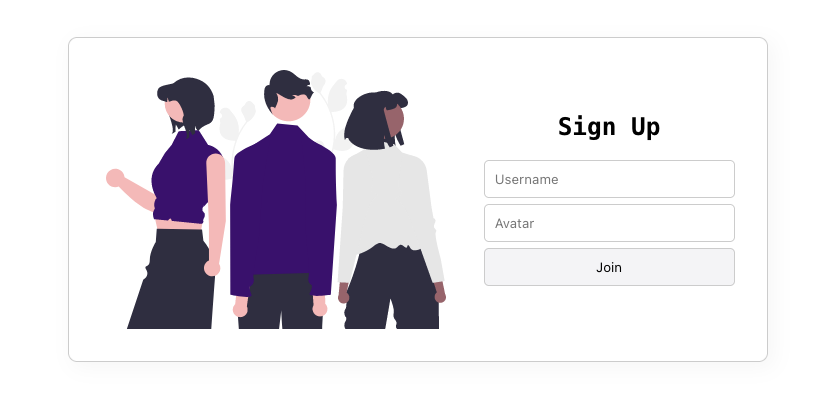
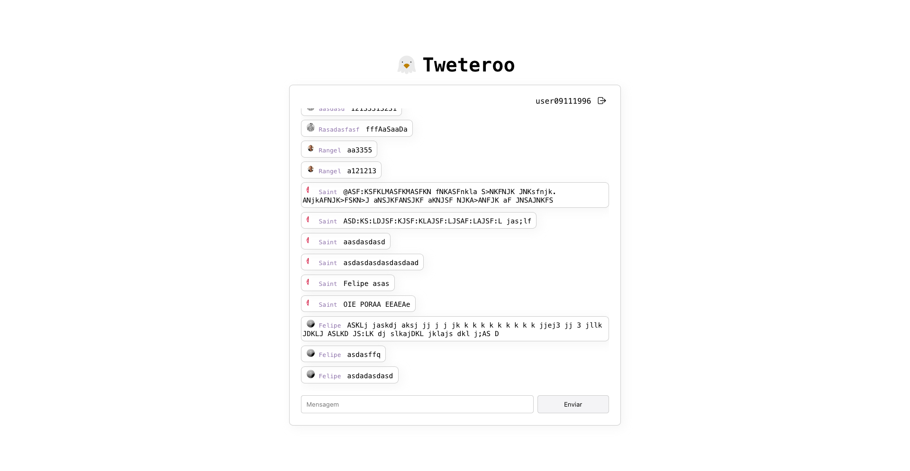

<h1 align="center">
Tweteroo
</h1>

<h4 align="center">
Um projeto simples e completo para aprender Angular e Node</h4>



**Tweteroo** é um projeto simples desenvolvido com Angular, Node, Express, MongoDB e Mongoose. Ele é um ótimo projeto para praticar:

- **Angular**: Tweteroo usa **Angular** na interface. Desenvolvendo o projeto você pratica o uso de componentes, diretivas, pipes e outros recursos do Angular.

- **Node**: Tweteroo usa **Node** para criar o backend da **API**. Desenvolvendo o projeto, pratica **Express**, **MongoDB** e **Mongoose**.


### Aqui estão alguns dos conceitos que você aprenderá ao desenvolver Tweteroo:

- **Receber dados de formulários no Angular**: Tweteroo usa formulários para receber informações do usuário. Desenvolvendo o projeto, você aprende a usar o sistem de formulario do Angular.
- **Trafegar dados entre a aplicação em Angular**: Você ira trafegar dados entre as camadas de services de componente e apartir da interface da aplicação.
- **Fazer request e enviar dados para API**: Tweteroo usa o o modulo de HTTP do angular para fazer request e enviar dados para a API.
- **Renderizar dados**: Ao receber informaçoes elas são usadas em componentes para renderizar os dados na interface de usuário.
- **Sistemas de rotas no Angular**: Para o sistema funcionar  o sistema de rotas controla o fluxo do aplicativo.




### Tecnologias usadas

**Front-end** _(interface)_**:**
- **[Angular 16](https://angular.io/)**
- **[CSS](https://developer.mozilla.org/pt-BR/docs/Web/CSS)**

**Back-end** _(servidor)_**:**
- **[NodeJS](https://nodejs.org/)**
- **[Express](https://expressjs.com/)**
- **[MongoDB](https://www.mongodb.com)**
- **[Mongoosejs](https://mongoosejs.com/)**
- **[Joi](https://joi.dev/)**


## Como rodar o projeto

_Para rodar o projeto ambos Front-end e Back-end devem estar rodando._

### **Como rodar o back-end**

1. Clone o repositório do back-end:
<br>
    ```bash
    git clone https://github.com/Yokuny/Tweteroo-BackEnd
    ```
2. Preencha `.env` como `.env.example`:
<br>
    ```bash
    MONGODB_URI # MongoDB conexão string
    PORT # Porta do servidor que será usada no front-end
    ```

3. Instale as dependências:
<br>
    ```bash
    npm install
    ```

4. Rode o projeto em modo de desenvolvimento:
<br>
    ```bash
    npm run start
    ```

### **Como rodar o front-end**

1. Clone o repositório do projeto:
<br>
    ```bash
    git clone https://github.com/Yokuny/Tweteroo
    ```

2. Instale as dependências:
<br>
    ```bash
    npm install
    ```

3. Confira `src/environments/environment.ts` tem o mesmo valor de `port`:
<br>
    ```bash=
    apiKey: 'http://localhost:5000/',
    ```

4. Rode o projeto em modo de desenvolvimento:
<br>
    ```bash
    npm run start
    ```
<br>

